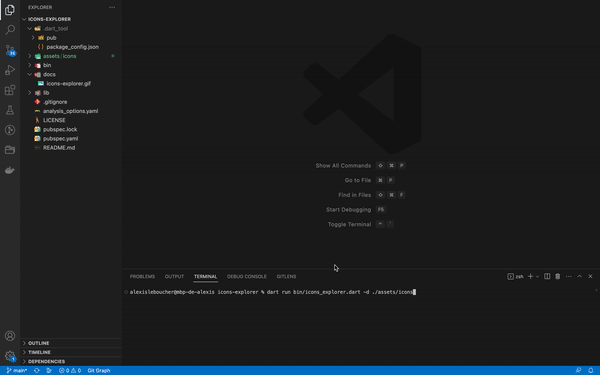

<h1 align="center">Icons Explorer</h1>

  <b>A simple Dart console app that displays all the SVG located in a directory in your browser and allows to search by name.</b> 
  Made with ❤️ by <a href="https://github.com/alexleboucher">Alex Le Boucher</a>

## Overview
This app builds an HTML page with all the svg located in the directory and open it in your browser.
On the page, you can also search by name.
You can compile the app and add the executable into one of your project.

## Getting Started
You must pass the argument `--dirPath` (or `-d`) to specify the path of your SVG folder.

#### Run with dart
`dart run bin/icons_explorer.dart -d ./assets/icons` (`./assets/icons` is an example, you must replace it by your folder path)

#### Compile
##### For mac or linux
`dart compile exe --output=icons_explorer bin/icons_explorer.dart`

##### For windows
`dart compile exe bin/icons_explorer.dart --output=icons_explorer.exe`